# Nº 1: Visibilidade do status do sistema
O design deve sempre manter os usuários informados sobre o que está acontecendo, por meio de feedback apropriado em um período de tempo razoável.

1 - Interface que apresenta qual aula está, sem precisar explicar para o usuario do sistema
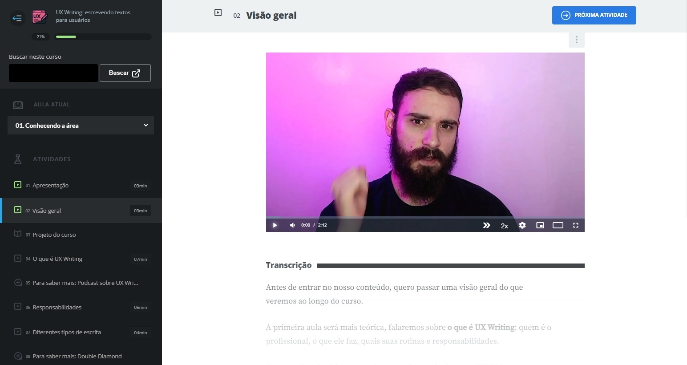

2 - Youtube exibindo os videos a direita, para que saiba em qual está e qual serão os próximos

3 - Playlist do Spotify mostrando as musicas que vão tocar, autor, tempo e outras informações relevantes

# 2: Correspondência entre o sistema e o mundo real
O design deve falar a linguagem dos usuários. Use palavras, frases e conceitos familiares ao usuário, em vez de jargões internos. Siga as convenções do mundo real, fazendo com que as informações apareçam em uma ordem natural e lógica.

1 - Apps com imagens relacionadas ao mundo real, que tornam intuitivo entender do que se trata o app apenas de olhar

2 - Imagem nas opções que tornam fácil para o usuario aprender e se guiar, tornando intuitivo
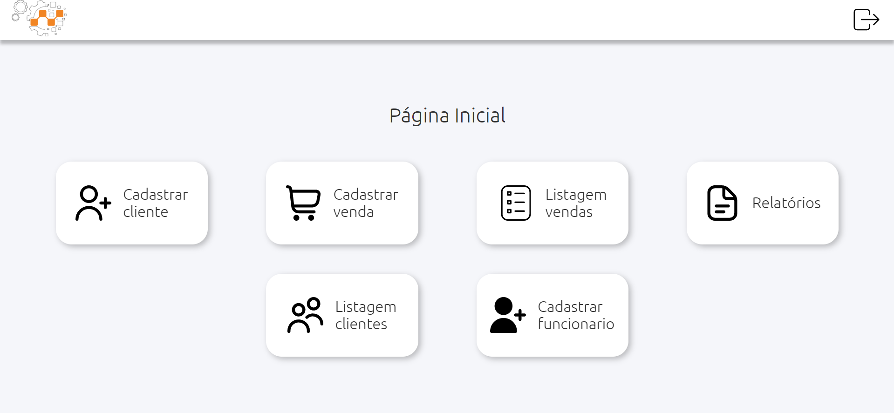

3 - Um exemplo não convencional, um aplicativo de bússula possue um desiner igual a uma bússula da vida real
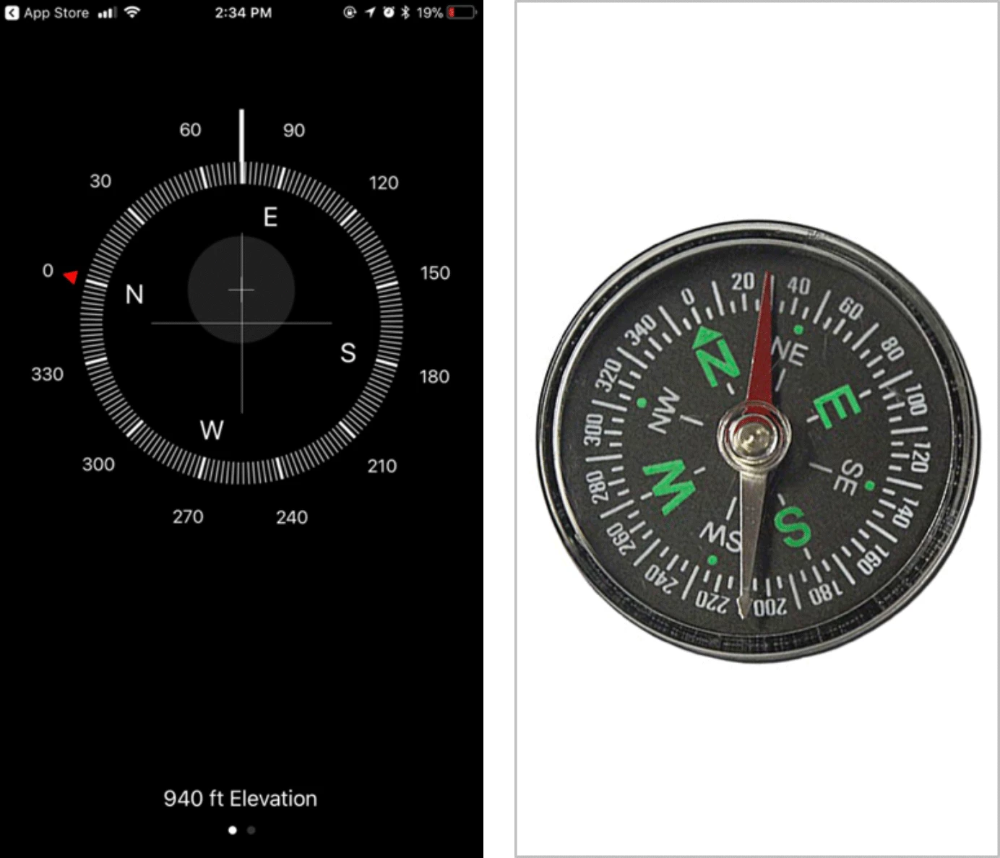

# Nº 3: Controle e liberdade do usuário
Os usuários geralmente executam ações por engano. Eles precisam de uma "saída de emergência" claramente marcada para deixar a ação indesejada sem ter que passar por um processo prolongado.

1 - Após excluir um e-mail que é enviado pra lixeira, o usuario pode desfazer a ação
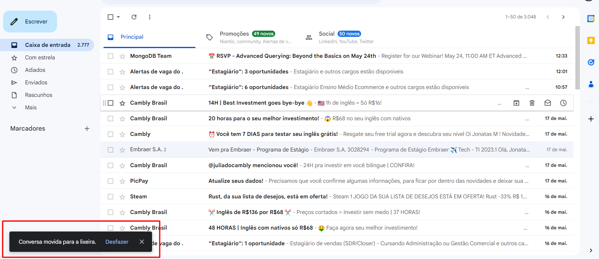

2 - Opções que permitem ao usuário modificar ou cancelar o pedido
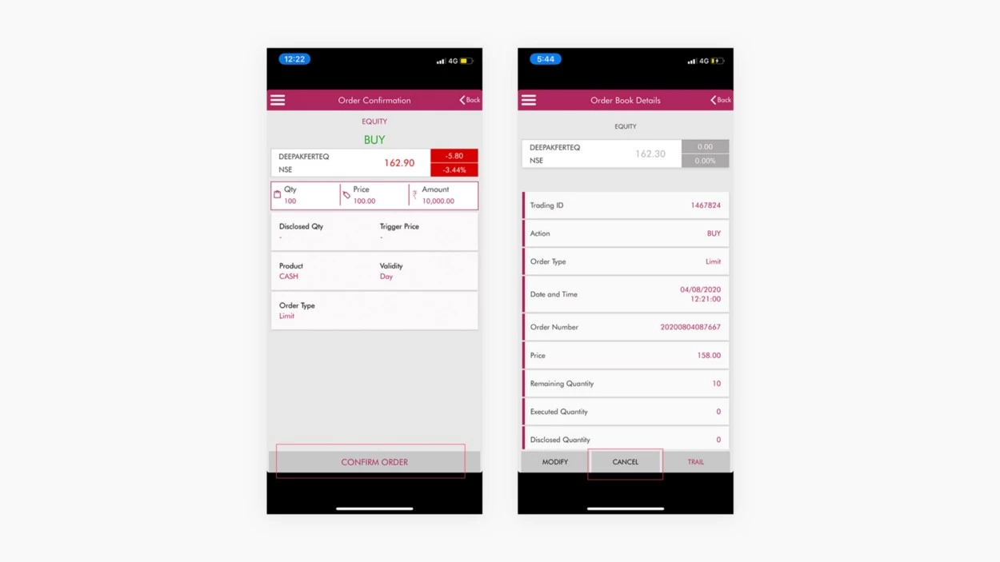

3 - Editores de texto possuem diversas funções, entre elas a mais conhecida é o ctrl + z, que permite voltar atrás em algo que u usuario do sistema fez e se arrependeu
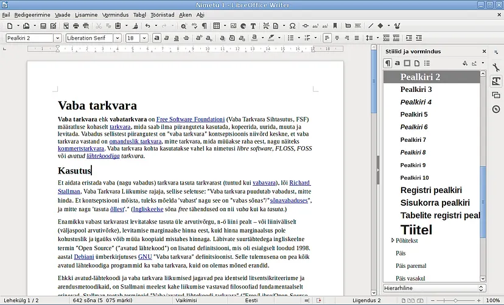

# Nº 4: Consistência e padrões
Os usuários não devem se perguntar se diferentes palavras, situações ou ações significam a mesma coisa. Siga as convenções da plataforma e do setor.

1 - Padronização da plataforma se mantendo mesmo acessando áreas diferentes

2 - Assim como anteriormente, padrão se mantendo
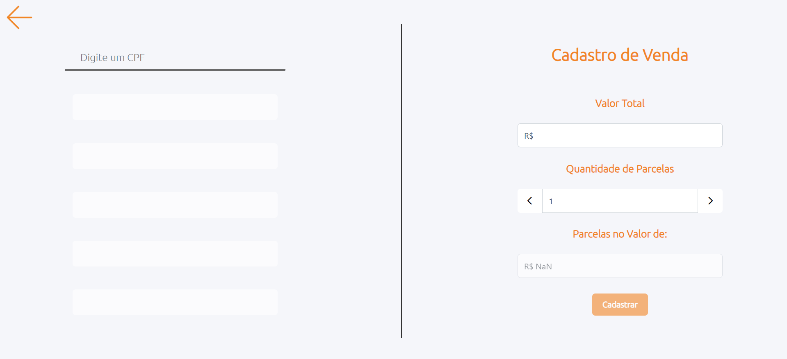

3 - Sempre que quer se enviar email para alguém, o padrão do gmail se mantem igualmente
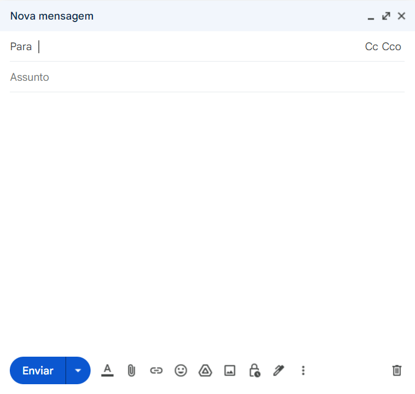

# Nº 5: Prevenção de erros
Boas mensagens de erro são importantes, mas os melhores projetos evitam cuidadosamente a ocorrência de problemas em primeiro lugar. Elimine as condições propensas a erros ou verifique-as e apresente aos usuários uma opção de confirmação antes que eles se comprometam com a ação.

1 - Mensagem de confirmação do whatzapp, para garantir que não ocorra um engano de o usuario apague uma mensagem sem querer

2 - Mensagem de confirmação para excluir um cliente
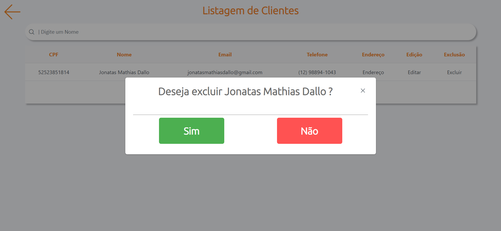

3 - Auto sugestão do google, para prevenir que o usuario escreva errado e consiga na primeira tentativa, encontrar o que está procurando

# Nº 6: Reconhecimento em vez de lembrança
Minimize a carga de memória do usuário tornando elementos, ações e opções visíveis. O usuário não deve ter que se lembrar de informações de uma parte da interface para outra. As informações necessárias para usar o design (por exemplo, rótulos de campo ou itens de menu) devem estar visíveis ou facilmente recuperáveis ​​quando necessário.

1 - Historico de compras, para caso a pessoa queira fazer uma compra do mesmo produto novamente, basta ir e clicar em comprar de novo
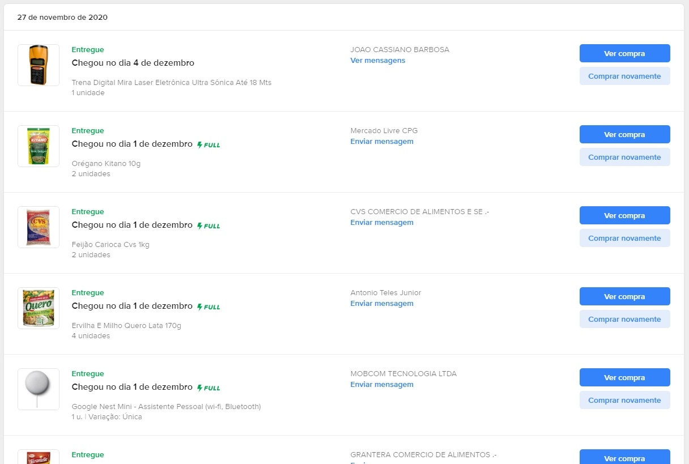

2 - Historico do Bing de páginas que foram recentemente acessadas, relembrando o usuario
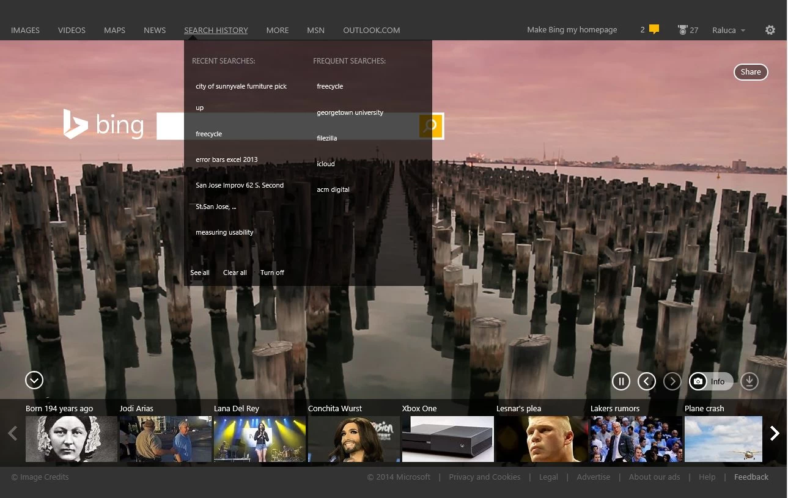

3 - Disponibilização do caminho que o usuario fez para chegar ali, tornando desncessário o usuario ter que decorar
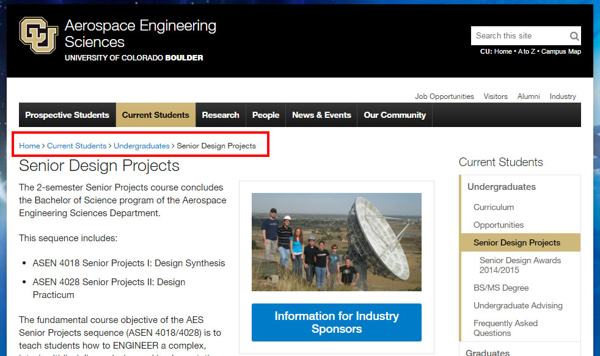

# Nº 7: Flexibilidade e eficiência de uso
Atalhos — ocultos para usuários novatos — podem acelerar a interação do usuário experiente para que o design possa atender tanto a usuários experientes quanto inexperientes. Permita que os usuários personalizem ações frequentes.

1 - Exemplo de interface que comporta usuarios leigos, e tem opção para usuarios experientes.
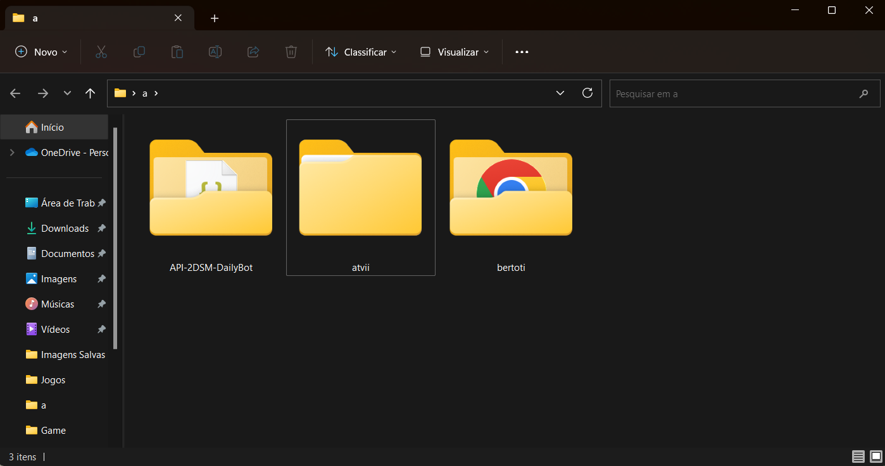
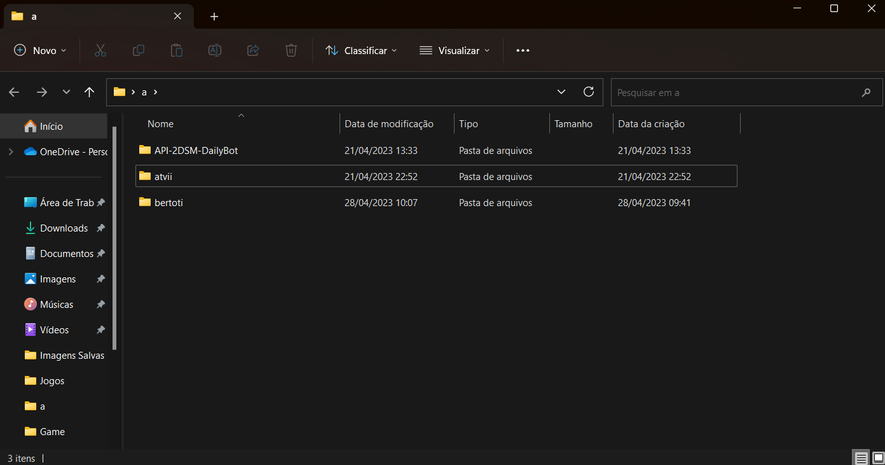

2 - O youtube é uma plataforma que permite leigos usarem facilmente, pausando video, mudadno volume e outras funções no menu abaixo, mas também suporta pessoas experientes com funções como "espaço" que pausa video, setinha pra esquerda e direita que pula 5 segundos por clique, e tecla "K" e "L" que pulam 10 segundos por clique.

3 - Atalhos do windows para pessoas experientes, assim como maneira de pessoas leigas fazerem
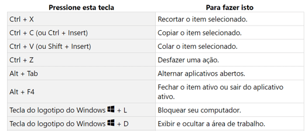

# Nº 8: Design estético e minimalista
As interfaces não devem conter informações irrelevantes ou raramente necessárias. Cada unidade extra de informação em uma interface compete com as unidades relevantes de informação e diminui sua visibilidade relativa.

1 - Interface sem informações desnecessarias, que entrega apenas as opções importantes e úteis para o usuario, sem competir com coisas irrelevantes

2 - Aqui temos o oposto de ser minimalista, se alguém quiser comprar apenas um celular, a tamanha poluição de serviços oferecidos ocupando a tela, faz com que torne difícil pro usuario achar o que ele quer
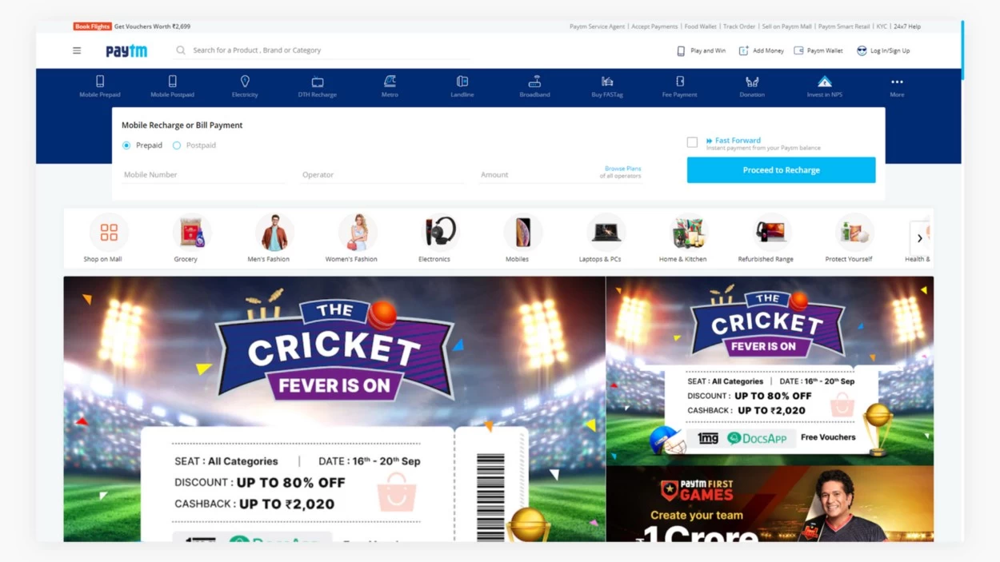

3 - Outro exemplo errado de tela com muita informação, do tipo que era feito antigamente antes de surgirem os conceitos de desing
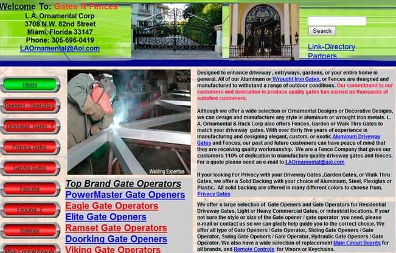

# Nº 9: Ajude os usuários a reconhecer, diagnosticar e recuperar-se de erros
As mensagens de erro devem ser expressas em linguagem simples (sem códigos de erro), indicar com precisão o problema e sugerir uma solução de forma construtiva.

1 - Exemplo da amazon de erro simples e com solução direta, caso o usuario tente comprar um chinelo sem escolher o tamanho

2 - Erro explicando que CPF já está cadastrado, portanto o funcionario já está no sistema
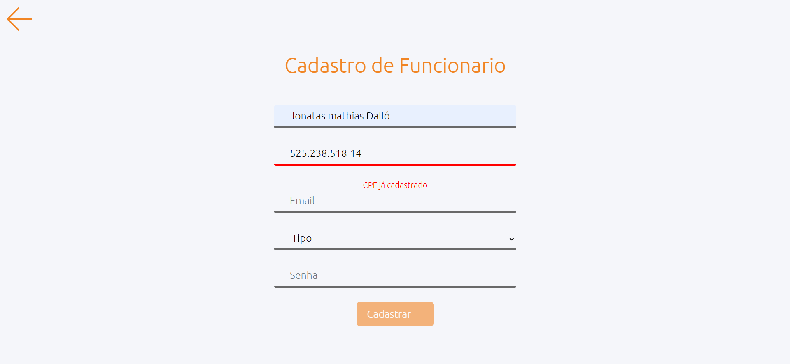

3 - Aviso orientando o usuario que é necessario preencher todos os campos, e indicando o campo que faltou preencher
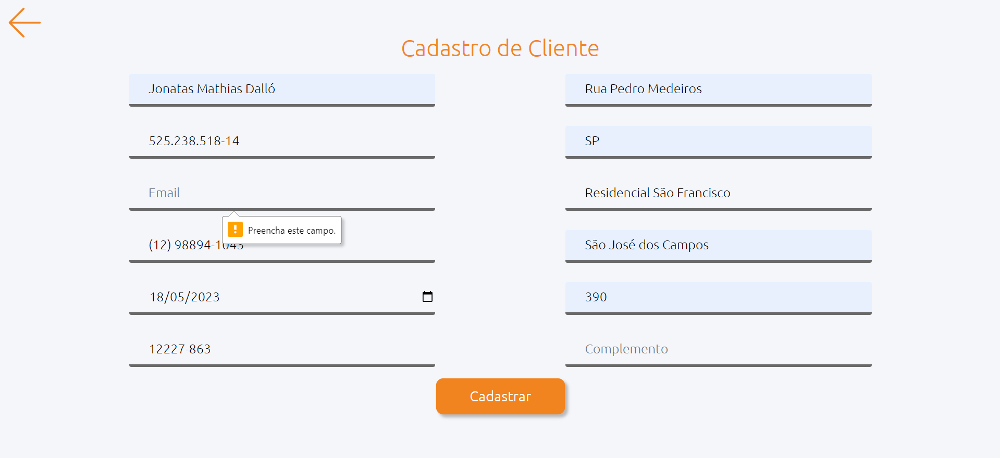

# Nº 10: Ajuda e documentação
É melhor que o sistema não precise de nenhuma explicação adicional. No entanto, pode ser necessário fornecer documentação para ajudar os usuários a entender como concluir suas tarefas.

1 - Exibição na hora de pagar da Amazon, mostrando as imagens dos tipos de cartão permitidos:
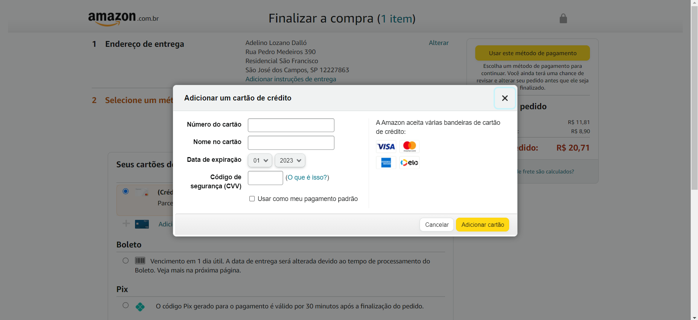

2 - Área com resposta pra possíveis duvidas que o usuario venha a ter
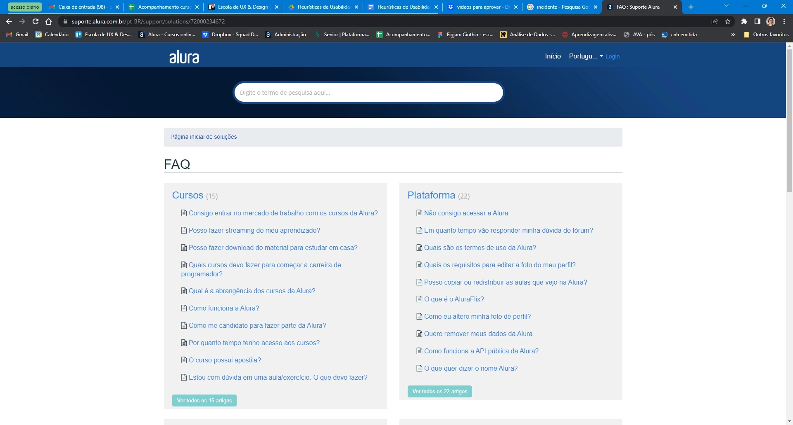

3 - Suporte com orientações para algumas questões e maneira de entrar em contato, para perguntar sobre questões especificas
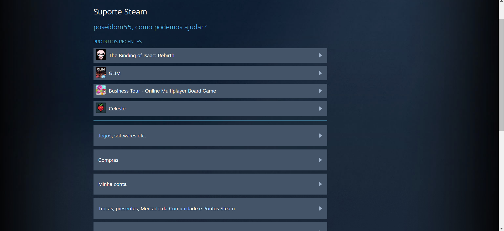

